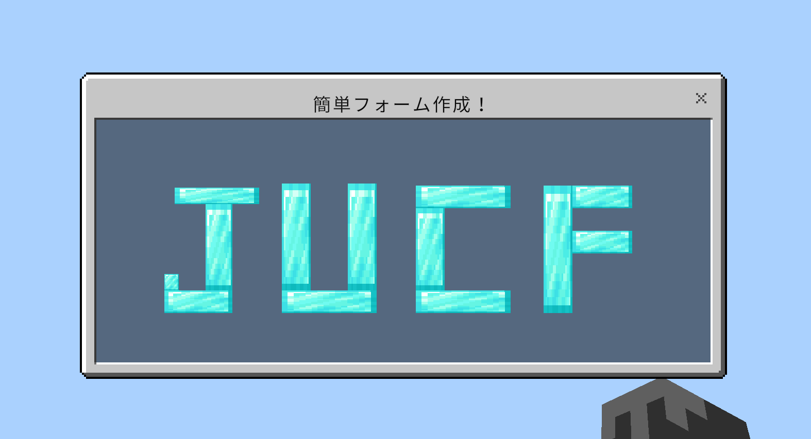

# JUCF-editor

[japanese](./README.md)/english

JUCF is an add-on for Minecraft integration that allows you to customize your forms without any knowledge of json-ui or scriptAPI.  
JUCF-editor allows you to create forms easily.  
*Actions other than display (such as executing a command when a button is pressed) require the use of scritpAPI.

## How to use JUCF

1. Download .mcpack for each behavior pack and resource pack
   - [JUCF-BP](https://github.com/Satoyans/JUCF-BP/releases)
   - [JUCF-RP](https://github.com/Satoyans/JUCF-RP/releases)
2. Add to World
    - All experimental toggles work even when turned off.

## How to display the created form

1. Execute the commands created in [editor](https://satoyans.github.io/JUCF-editor/) in sequence.
2. Execute `/scriptevent cfs:formname` or select "view" in `/scriptevent cf:list` to display it.

## Commands

- `/scriptevent cf:tag` Add forms from all player tags.
- `/scriptevent cf:list` Displays a list of registered forms.
- `/scriptevent cfs:<form_name> [json(variable)]` Sends the form to the calling player. You can also specify variables in the message portion.

## sample

[sample.md](./sample.md)

## memo

[memo.md(japanese)](./memo.md)

## Test Version

v1.21.20

Add-ons, distribution worlds, servers, etc. using JUCF are welcome. 
Please refrain from redistribution without modification of originality. 
Bug reports can be sent to this repository or Discord@satoyan_!

The item renderer id is part of bedrock-apis's [bds-docs](https://github.com/bedrock-apis/bds-docs).

Translated using DeepL.
