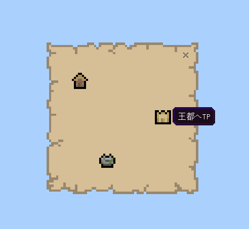

# サンプル

## マップ風



```json
{
  "form_name": "map_form",
  "form_size": {
    "x": "150",
    "y": "150"
  },
  "is_show_form_frame": "false",
  "variables": {},
  "elements": [
    {
      "h": "150",
      "w": "150",
      "x": "0",
      "y": "0",
      "text": "",
      "texture": "textures/map/map_background",
      "hover_text": "",
      "is_show_button": "false",
      "is_show_close": "false",
      "is_show_image": "true",
      "is_show_text": "false"
    },
    {
      "h": "10",
      "w": "10",
      "x": "140",
      "y": "-0",
      "text": "",
      "texture": "",
      "hover_text": "",
      "is_show_button": "false",
      "is_show_close": "true",
      "is_show_image": "false",
      "is_show_text": "false"
    },
    {
      "h": "16",
      "w": "16",
      "x": "25",
      "y": "30",
      "text": "",
      "texture": "textures/map/village_plains",
      "hover_text": "初期村にTP",
      "is_show_button": "true",
      "is_show_close": "false",
      "is_show_image": "true",
      "is_show_text": "false",
      "label": "初期村"
    },
    {
      "h": "16",
      "w": "16",
      "x": "107",
      "y": "65",
      "text": "",
      "texture": "textures/map/village_desert",
      "hover_text": "王都へTP",
      "is_show_button": "true",
      "is_show_close": "false",
      "is_show_image": "true",
      "is_show_text": "false",
      "label": "王都"
    },
    {
      "h": "16",
      "w": "16",
      "x": "52",
      "y": "108",
      "text": "",
      "texture": "textures/map/jungle_temple",
      "hover_text": "ダンジョンへTP",
      "is_show_button": "true",
      "is_show_close": "false",
      "is_show_image": "true",
      "is_show_text": "false",
      "label": "ダンジョン"
    }
  ]
}
```

## ステータス風


```json
{
  "form_name": "status_form",
  "form_size": {
    "x": "180",
    "y": "180"
  },
  "is_show_form_frame": "false",
  "variables": {
    "level": "15",
    "hp": "20",
    "next_level_exp": "80"
  },
  "elements": [
    {
      "h": "180",
      "w": "90",
      "x": "0",
      "y": "0",
      "text": "",
      "texture": "textures/ui/book_pageedge_left",
      "hover_text": "",
      "is_show_button": "false",
      "is_show_close": "false",
      "is_show_image": "true",
      "is_show_text": "false"
    },
    {
      "h": "180",
      "w": "90",
      "x": "90",
      "y": "0",
      "text": "",
      "texture": "textures/ui/book_pageedge_right",
      "hover_text": "",
      "is_show_button": "false",
      "is_show_close": "false",
      "is_show_image": "true",
      "is_show_text": "false"
    },
    {
      "h": "30",
      "w": "30",
      "x": "150",
      "y": "150",
      "text": "",
      "texture": "textures/ui/book_pageright_default",
      "hover_text": "次のページへ",
      "is_show_button": "true",
      "is_show_close": "false",
      "is_show_image": "true",
      "is_show_text": "false"
    },
    {
      "h": "10",
      "w": "10",
      "x": "166",
      "y": "2",
      "text": "",
      "texture": "",
      "hover_text": "",
      "is_show_button": "false",
      "is_show_close": "true",
      "is_show_image": "false",
      "is_show_text": "false"
    },
    {
      "h": "30",
      "w": "30",
      "x": "75",
      "y": "4",
      "text": "§lS T A T U S§r",
      "texture": "",
      "hover_text": "",
      "is_show_button": "false",
      "is_show_close": "false",
      "is_show_image": "false",
      "is_show_text": "true"
    },
    {
      "h": "30",
      "w": "30",
      "x": "59",
      "y": "38",
      "text": "Name",
      "texture": "",
      "hover_text": "",
      "is_show_button": "false",
      "is_show_close": "false",
      "is_show_image": "false",
      "is_show_text": "true"
    },
    {
      "h": "30",
      "w": "30",
      "x": "106",
      "y": "38",
      "text": "%player_nametag%",
      "texture": "",
      "hover_text": "",
      "is_show_button": "false",
      "is_show_close": "false",
      "is_show_image": "false",
      "is_show_text": "true"
    },
    {
      "h": "30",
      "w": "30",
      "x": "60",
      "y": "57",
      "text": "Level",
      "texture": "",
      "hover_text": "",
      "is_show_button": "false",
      "is_show_close": "false",
      "is_show_image": "false",
      "is_show_text": "true"
    },
    {
      "h": "30",
      "w": "30",
      "x": "91",
      "y": "57",
      "text": "%level%",
      "texture": "",
      "hover_text": "",
      "is_show_button": "false",
      "is_show_close": "false",
      "is_show_image": "false",
      "is_show_text": "true"
    },
    {
      "h": "30",
      "w": "30",
      "x": "60",
      "y": "69",
      "text": "next",
      "texture": "",
      "hover_text": "",
      "is_show_button": "false",
      "is_show_close": "false",
      "is_show_image": "false",
      "is_show_text": "true"
    },
    {
      "h": "30",
      "w": "30",
      "x": "97",
      "y": "70",
      "text": "%next_level_exp% exp",
      "texture": "",
      "hover_text": "",
      "is_show_button": "false",
      "is_show_close": "false",
      "is_show_image": "false",
      "is_show_text": "true"
    },
    {
      "h": "30",
      "w": "30",
      "x": "60",
      "y": "89",
      "text": "HP",
      "texture": "",
      "hover_text": "",
      "is_show_button": "false",
      "is_show_close": "false",
      "is_show_image": "false",
      "is_show_text": "true"
    },
    {
      "h": "30",
      "w": "30",
      "x": "90",
      "y": "89",
      "text": "%hp%",
      "texture": "",
      "hover_text": "",
      "is_show_button": "false",
      "is_show_close": "false",
      "is_show_image": "false",
      "is_show_text": "true"
    }
  ]
}
```

## RLクラフト風


```json
{
  "form_name": "bell_form",
  "form_size": {
    "x": "300",
    "y": "180"
  },
  "is_show_form_frame": "true",
  "variables": {},
  "elements": [
    {
      "h": "180",
      "w": "300",
      "x": "0",
      "y": "0",
      "text": "",
      "texture": "textures/ui/cell_image_darkgrey",
      "hover_text": "",
      "is_show_button": "false",
      "is_show_close": "false",
      "is_show_image": "true",
      "is_show_text": "false"
    },
    {
      "h": "120",
      "w": "72",
      "x": "120",
      "y": "30",
      "text": "element",
      "texture": "textures/ui/dressing_room_capes",
      "hover_text": "",
      "is_show_button": "false",
      "is_show_close": "false",
      "is_show_image": "true",
      "is_show_text": "false"
    },
    {
      "h": "24",
      "w": "24",
      "x": "200",
      "y": "35",
      "text": "",
      "texture": "textures/ui/hardcore/heart",
      "hover_text": "",
      "is_show_button": "false",
      "is_show_close": "false",
      "is_show_image": "true",
      "is_show_text": "false"
    },
    {
      "h": "24",
      "w": "24",
      "x": "225",
      "y": "35",
      "text": "",
      "texture": "textures/ui/hardcore/heart",
      "hover_text": "",
      "is_show_button": "false",
      "is_show_close": "false",
      "is_show_image": "true",
      "is_show_text": "false"
    },
    {
      "h": "20",
      "w": "20",
      "x": "252",
      "y": "37",
      "text": "",
      "texture": "textures/ui/heart_background",
      "hover_text": "",
      "is_show_button": "false",
      "is_show_close": "false",
      "is_show_image": "true",
      "is_show_text": "false"
    },
    {
      "h": "24",
      "w": "24",
      "x": "60",
      "y": "35",
      "text": "",
      "texture": "textures/ui/hardcore/heart_half",
      "hover_text": "",
      "is_show_button": "false",
      "is_show_close": "false",
      "is_show_image": "true",
      "is_show_text": "false"
    },
    {
      "h": "24",
      "w": "24",
      "x": "35",
      "y": "35",
      "text": "",
      "texture": "textures/ui/hardcore/heart",
      "hover_text": "",
      "is_show_button": "false",
      "is_show_close": "false",
      "is_show_image": "true",
      "is_show_text": "false"
    },
    {
      "h": "24",
      "w": "24",
      "x": "10",
      "y": "35",
      "text": "",
      "texture": "textures/ui/hardcore/heart",
      "hover_text": "",
      "is_show_button": "false",
      "is_show_close": "false",
      "is_show_image": "true",
      "is_show_text": "false"
    },
    {
      "h": "24",
      "w": "24",
      "x": "10",
      "y": "70",
      "text": "",
      "texture": "textures/ui/heart",
      "hover_text": "",
      "is_show_button": "false",
      "is_show_close": "false",
      "is_show_image": "true",
      "is_show_text": "false"
    },
    {
      "h": "24",
      "w": "24",
      "x": "35",
      "y": "70",
      "text": "",
      "texture": "textures/ui/heart",
      "hover_text": "",
      "is_show_button": "false",
      "is_show_close": "false",
      "is_show_image": "true",
      "is_show_text": "false"
    },
    {
      "h": "20",
      "w": "20",
      "x": "62",
      "y": "72",
      "text": "",
      "texture": "textures/ui/heart_background",
      "hover_text": "",
      "is_show_button": "false",
      "is_show_close": "false",
      "is_show_image": "true",
      "is_show_text": "false"
    },
    {
      "h": "24",
      "w": "24",
      "x": "200",
      "y": "70",
      "text": "",
      "texture": "textures/ui/heart",
      "hover_text": "",
      "is_show_button": "false",
      "is_show_close": "false",
      "is_show_image": "true",
      "is_show_text": "false"
    },
    {
      "h": "20",
      "w": "20",
      "x": "227",
      "y": "72",
      "text": "",
      "texture": "textures/ui/heart_background",
      "hover_text": "",
      "is_show_button": "false",
      "is_show_close": "false",
      "is_show_image": "true",
      "is_show_text": "false"
    },
    {
      "h": "20",
      "w": "20",
      "x": "252",
      "y": "72",
      "text": "",
      "texture": "textures/ui/heart_background",
      "hover_text": "",
      "is_show_button": "false",
      "is_show_close": "false",
      "is_show_image": "true",
      "is_show_text": "false"
    }
  ]
}
```
